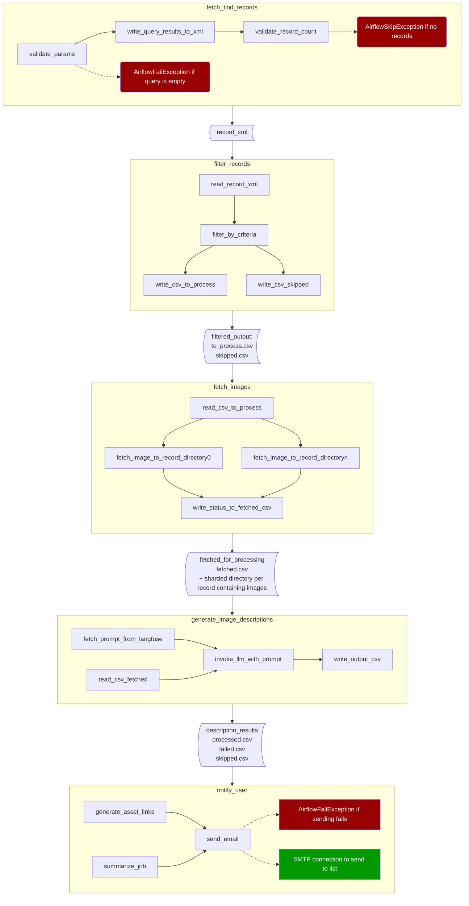

# Batch Image Description Dags and tasks

```mermaid
flowchart TB

    subgraph fetch_tind_records
        direction LR
        validate_params-->write_query_results_to_xml-->validate_record_count
        
        validate_params-.->stop0("AirflowFailException if query is empty")
        validate_record_count-.->stop1("AirflowSkipException if no records")
    end


    subgraph filter_records
        direction TB
        read_record_xml --> filter_by_criteria --> write_csv_to_process & write_csv_skipped
    end


    subgraph fetch_images
        direction TB
        read_csv_to_process --> fetch_image_to_record_directory0 & fetch_image_to_record_directoryn --> write_status_to_fetched_csv
    end 

    subgraph generate_image_descriptions
        fetch_prompt_from_langfuse & read_csv_fetched --> invoke_llm_with_prompt --> write_output_csv
    end

    subgraph notify_user
        generate_asset_links & summarize_job --> send_email -.-> stop2["AirflowFailException if sending fails"] & success0["SMTP connection to send to list"]
    end


    fetch_tind_records --> record_xml@{shape: bow-rect} --> filter_records --> filtered_output@{shape: bow-rect, label: "filtered_output:\n\nto_process.csv\nskipped.csv"} -->fetch_images --> fetched_for_processing@{shape: bow-rect, label: "fetched_for_processing\n\nfetched.csv\n+ sharded directory per record containing images"}-->generate_image_descriptions -->description_results@{shape: bow-rect, label: "description_results\n\nprocessed.csv\nfailed.csv\nskipped.csv"} -->notify_user

    classDef stop fill: #900,color:#fff
    classDef success fill: #090,color:#fff
    class stop0,stop1,stop2 stop;
    class success0 success;
```